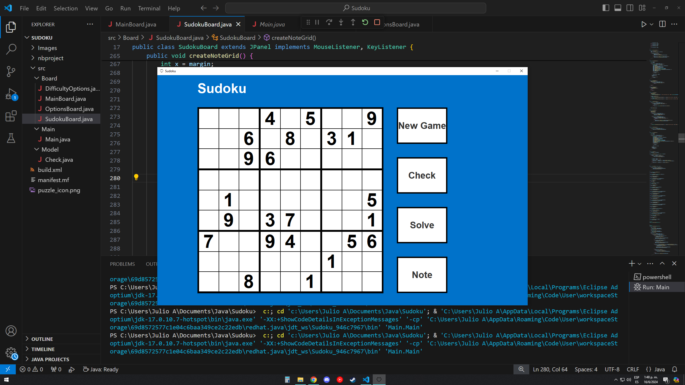
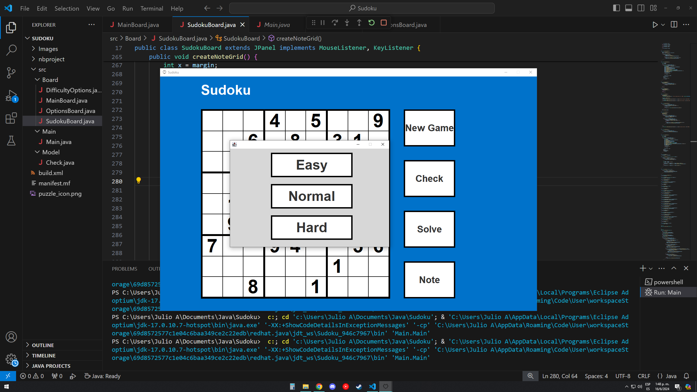
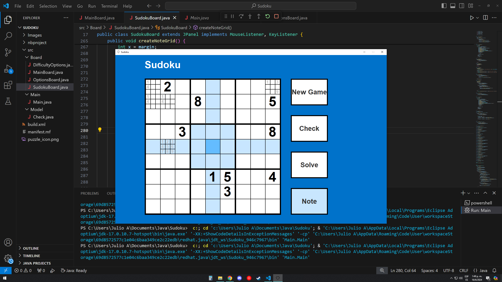
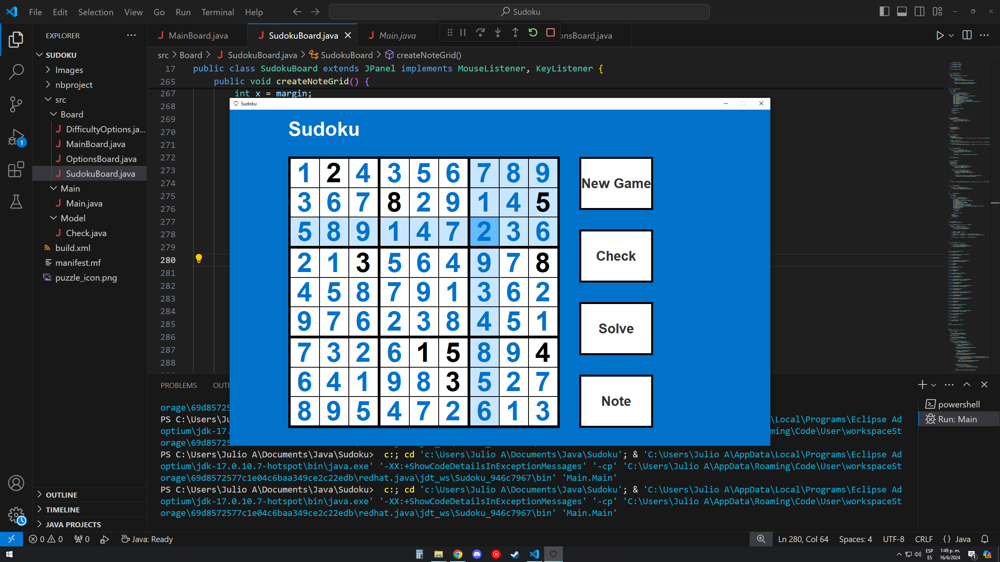
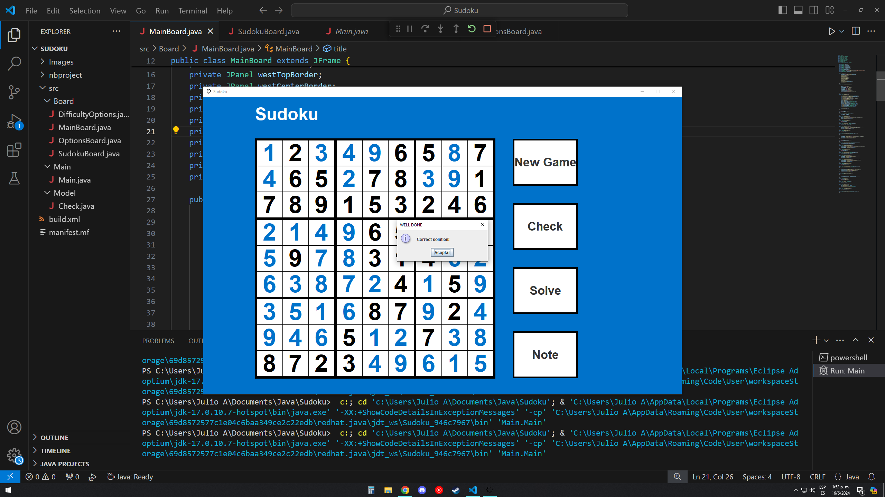
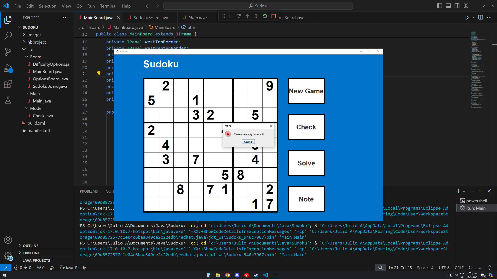
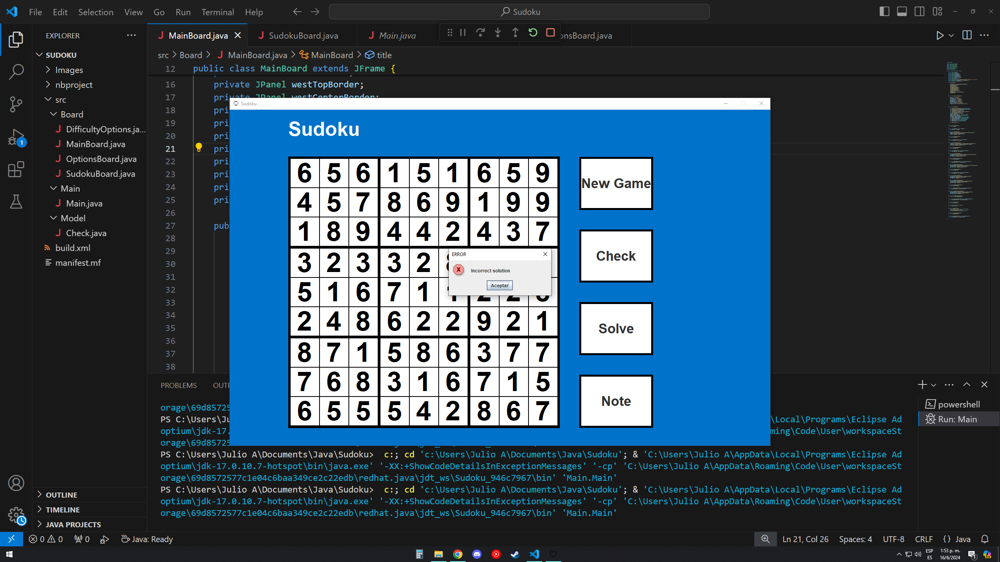

# Sudoku
Sudoku game with notes, automatic solve button and difficulty options

## Built with:
Java

## Features:
- Option to take notes for the possible numbers in each square, they can be erased by pressing the number you no longer want
- Erase actual numbers with space bar
- Let the computer solve the current sudoku by pressing the solve button
- Select your difficulty everytime you want to play a new game
- Check if your solution is correct by pressing the check button

## How to use:
1. Install java
2. Run the program

## Credits:
Julio Salazar
